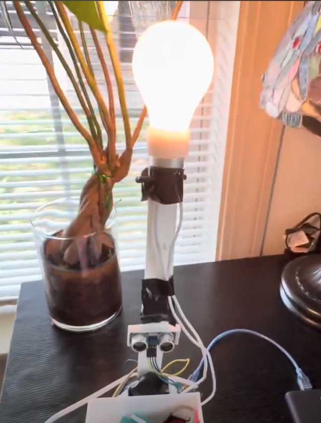

# HC-SR04-Lamp

This is an ultrasonic sensor motion lamp I made that utilizes a counter variable that increments by 1 when an object is sensed, and if the counter variable is even it turns on, otherwise turns off.

My Utrasonic sensor motion lamp! :> https://www.youtube.com/watch?v=yUE8ARo-8gY&amp;t=5s
